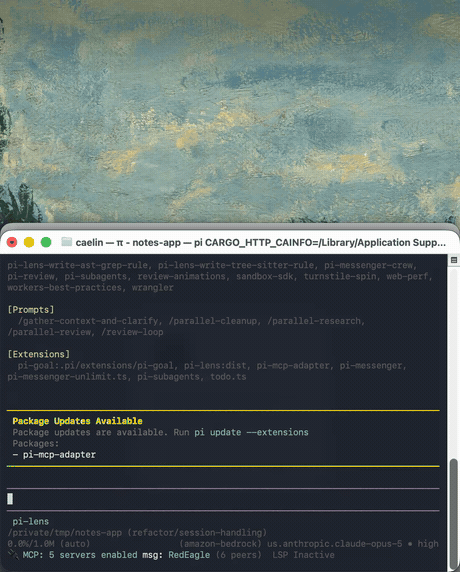

# Baton

A macOS notch that agents can hand work to.

Your coding agents run in ten worktrees. One of them needs you: review this diff,
open this preview, pick A or B, approve this migration. Today it blocks in a
terminal tab you are not looking at.

Baton gives agents an MCP tool to ask, and gives you one place to answer.

<p align="center">
  
</p>

Above: a real pi agent asks for a review before committing. The notch slides in
with the branch and the change, the checks get ticked, one click approves, and the
agent carries on. Nothing was staged; that is the actual loop.

```text
Agent ──▶ baton-mcp (MCP over stdio) ──▶ tasks.db ◀── Baton.app ──▶ you
                                            ▲                         │
                                            └──── your answer ────────┘
```

## What it looks like

The shell hangs from the top of your screen. It is a pill at rest, a card when
you look at it, and a slim bar while you work.

| State | What it shows |
| --- | --- |
| Idle | A pill hugging the notch. A count and a priority dot. |
| Peek | A task arrives, expands for a few seconds, collapses. |
| Card | The full task: context, links, checklist, choices, actions. |
| Working | A slim bar you can work under, in another app, with the next check and a Done button. |
| Queue | Every open task, grouped by worktree. |

The card is built on Liquid Glass: `GlassEffectContainer`, `glassEffect`, and
`glassEffectID`, so the shell morphs between states instead of cutting.

## Install

Requires macOS 26 and Xcode 26.

```bash
git clone https://github.com/caelinsutch/baton.git
cd baton
scripts/install.sh
```

That does the four things needed to make it stick:

- Installs `Baton.app` to `/Applications`, not a build directory that a clean
  build would wipe.
- Adds a login item, so the notch is there tomorrow.
- Registers the MCP server with both harnesses: `~/.pi/agent/mcp.json`, which is
  the file pi reads and is not `settings.json`, and `~/.claude.json` at user
  scope, so every Claude Code project and Conductor worktree sees it.
- Adds a short section to `~/.pi/agent/AGENTS.md` and `~/.claude/CLAUDE.md`
  telling agents the tool exists and, importantly, that a question in their
  output is the wrong channel when nobody is watching that terminal. Without
  that last part an agent asks in text and stalls.

Claude Code reads its MCP servers once at session start, so restart any session
that is already open.

Then check notifications once:

```bash
scripts/check-notifications.sh
```

Undo everything with `scripts/install.sh --uninstall`. Your task database and
settings are left alone.

For other harnesses, `scripts/install-mcp.sh` prints the configuration to paste,
and `agents/AGENTS-snippet.md` is the longer prompt for a project `AGENTS.md`.

## The tools

| Tool | Blocks | Use |
| --- | --- | --- |
| `ask_human` | Yes | Submit and wait in one call. The common case. |
| `submit_task` | No | Queue a task and end your turn. |
| `await_task` | Yes | Wait on an id you already have. |
| `get_task` | No | Check for an answer. |
| `list_tasks` | No | Find your tasks after a restart. |
| `cancel_task` | No | Withdraw a question you answered yourself. |

A blocking call defaults to 120 seconds and caps at 900. A timeout returns
`status: "pending"`, not an error. The task stays open.

## Keys

Inside the card:

| Key | Action |
| --- | --- |
| `⌘↩` | Confirm: approve, send the choice, or send the answer |
| `⌘⇧↩` | Send back, with a note |
| `⌘1`–`⌘8` | Pick a choice |
| `esc` | Close the card |

These need the card to hold the keyboard, which happens once you open the
send-back note. The rest of the time the notch deliberately does not take focus,
so reach for the global keys instead.

Global, from any app:

| Key | Action |
| --- | --- |
| `⌥⌘B` | Show the queue |
| `⌥⌘↩` | Mark the current task done |
| `⌥⌘⌫` | Send the current task back |

The global keys carry `⌥⌘` on purpose. A global `⌘↩` would break confirm in every
other app.

## Send back, not just done

"Done" is easy. "Send back" carries the information.

A send-back returns the note, plus the checklist state. An unticked required item
comes back as `failedChecks`, so the agent gets told which check failed by name
rather than "it looks wrong". That is what makes the round trip converge.

## How the agent finds out

Two paths. Both are verified end to end against a real pi agent.

### The agent is waiting

It called `ask_human` or `await_task`, so it is blocked inside that tool call,
polling its own row every 200 to 300 ms. Your answer reaches it in well under a
second. Nothing to configure.

### The agent already ended its turn

It called `submit_task` and stopped. The process is gone, so nothing can tell it.
Your answer sits in the database until that agent runs again.

A wake hook fixes this. Baton runs it when you resolve a task, from the task's
worktree:

`~/Library/Application Support/dev.baton/config.json`

```json
{
  "onResolve": {
    "command": "/opt/homebrew/bin/pi",
    "args": ["--continue", "--print", "{summary}"],
    "decisions": ["approved", "sentBack", "answered", "chose"],
    "requireSessionId": false,
    "requireWorktree": true
  }
}
```

`pi --continue` resumes the newest session for the working directory, which is
why `requireWorktree` matters: without a worktree the hook would run somewhere
else and wake an unrelated agent. Baton refuses instead of guessing.

Prefer `{summary}`. It is a finished sentence that handles the empty cases, so an
approval with no note does not produce `approved on "X":  Failed checks:`. The
raw parts are also available: `{id}` `{sessionId}` `{agent}` `{decision}`
`{status}` `{title}` `{text}` `{worktree}` `{branch}` `{failedChecks}`.

This works. An agent that had already exited was resumed by the hook, read
"The human approved ...", and went on to do the work.

You own that config file. The MCP tools cannot write it, `command` must be an
absolute path to an executable, and Baton runs it directly with no shell. A task
payload supplies data, never the program. Check the wiring with
`baton-mcp doctor`.

### Addressing a session by id

If your harness resumes by session id rather than by directory, use that instead:

```json
{
  "onResolve": {
    "command": "/opt/homebrew/bin/pi",
    "args": ["--session-id", "{sessionId}", "--print", "{summary}"],
    "requireSessionId": true
  }
}
```

Baton fills `sessionId` from whatever the agent passed, and otherwise detects it
from the environment: `BATON_SESSION_ID` first, then `sessionEnvKeys` from your
config, then a built-in table, then any `<PREFIX>_SESSION_ID` variable that is not
from a terminal or a cloud SDK.

One caveat worth knowing: **a harness does not have to pass its session to an MCP
server, and pi does not.** So under pi the id is only present when the agent
passes `sessionId` itself, which is why the directory-based hook above is the
reliable option. Add your own variable with `sessionEnvKeys` if your harness
exports one:

```json
{ "sessionEnvKeys": ["MY_AGENT_SESSION"] }
```

### From a shell, with no MCP client

```bash
ID=$(baton-mcp submit "Review before commit" --worktree "$PWD" --base main)
baton-mcp watch "$ID" && git commit   # exit 0 approved, 3 sent back, 4 expired
```

## How it works

The **SQLite database is the source of truth**, not the app. Every `baton-mcp`
process and the app open the same file in WAL mode. This means:

- An agent can submit a task while the app is closed.
- A blocking wait is a poll on one row, so a dropped signal cannot lose an
  answer.
- The app can crash without losing the queue.

The app is a viewer and a notifier. It is not a broker.

## Layout

```text
Sources/
  BatonCore/     Model, SQLite store, guardrails, git probe, JSON
  BatonMCP/      MCP server over stdio, plus shell subcommands
  BatonApp/      SwiftUI app: notch panel, glass views, notifications, hotkeys
scripts/
  build-app.sh   Assemble Baton.app
  install-mcp.sh Print or check the agent config
  make-icon.swift Render the icon, generated not committed
  release.sh     Sign, notarize, package a DMG
  smoke-mcp.sh   End-to-end protocol and round-trip check
  check-notifications.sh  Diagnose notification delivery and post a test banner
  record-demo.sh  Re-record the demo above, end to end with a real agent
  install.sh      Install to /Applications, add a login item, wire up pi and
                  Claude Code
agents/
  AGENTS-snippet.md  The prompt that makes agents use it
```

Zero external dependencies. SQLite is the system library, the MCP protocol is
hand-rolled JSON-RPC, and the global hotkeys use Carbon.

## Development

```bash
swift build            # build
swift test             # unit tests
scripts/smoke-mcp.sh   # end-to-end MCP check
swiftlint              # lint

# Drive the app without an agent:
baton-mcp submit "Check the modal" --worktree ~/code/app --check "Closes on Escape"
baton-mcp list
baton-mcp respond <id> back "Focus lands on the wrong button."
```

Set `BATON_DEBUG=1` and run the binary directly to trace the notch. In debug a
new task opens the full card at once, instead of peeking and collapsing, because
hover is awkward to drive from a script:

```bash
BATON_DEBUG=1 ./dist/Baton.app/Contents/MacOS/BatonApp
```

The trace prints each phase change, the measured shell frame, and whether the
panel holds the keyboard. The shell frame is also the hit area: everything
outside it passes clicks through to the app underneath.

## Notifications

Run this after the first build:

```bash
scripts/check-notifications.sh
```

It reports the real authorization status and posts a test banner.

The failure mode is confusing enough to be worth naming. If Baton is switched off
in System Settings, `requestAuthorization` returns "Notifications are not allowed
for this application", macOS does not prompt, and posting still reports success.
So tasks arrive with no banner and nothing looks broken. The script detects that
and opens the right settings pane.

An ad-hoc signature is fine for this. macOS keys notification permission on the
bundle id, not the signature, so the permission survives a rebuild even though
the code hash changes on every build.

Two things do need a real Developer ID:

- Running Baton on someone else's machine without a Gatekeeper warning.
- Time Sensitive alerts, used by `urgent`, which need a restricted entitlement
  Apple must grant. `scripts/build-app.sh` only attaches the entitlements file
  when the identity is a Developer ID, because launchd refuses to spawn a binary
  that claims a restricted entitlement without a matching profile. Without it,
  `urgent` posts a normal banner instead of breaking through Focus.

## Guardrails

An MCP tool that can interrupt you needs limits.

- 20 tasks per session per minute, then a clear error telling the agent to batch.
- Links open only on a click, and only for `http`, `https`, `file`, and known
  editor schemes. No `javascript:`, no `data:`.
- Titles, bodies, choices, and checklists are all bounded.
- Markdown renders inline only. Remote images do not load.
- A task whose agent process died is labelled "agent gone", so you do not spend
  attention on work nobody is waiting for.

## Status

Early. The core loop works end to end: an agent asks, you see it, you answer, the
agent continues. See `DESIGN.md` for the reasoning and the roadmap.

## Licence

MIT
